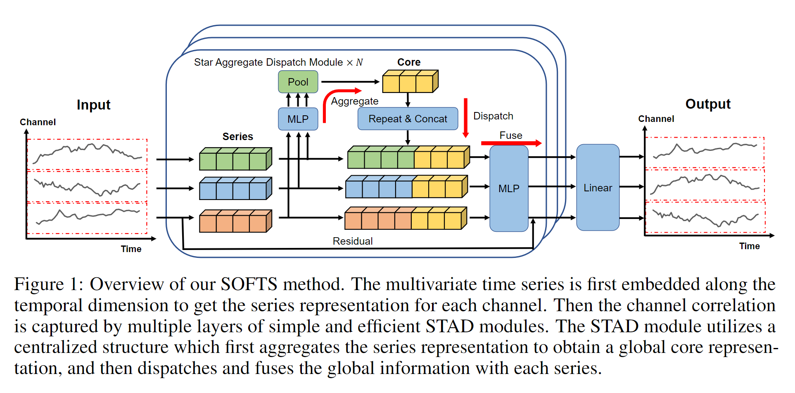
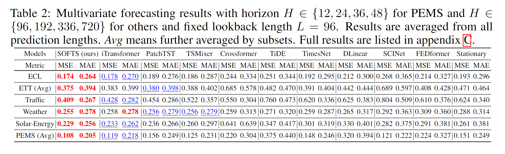
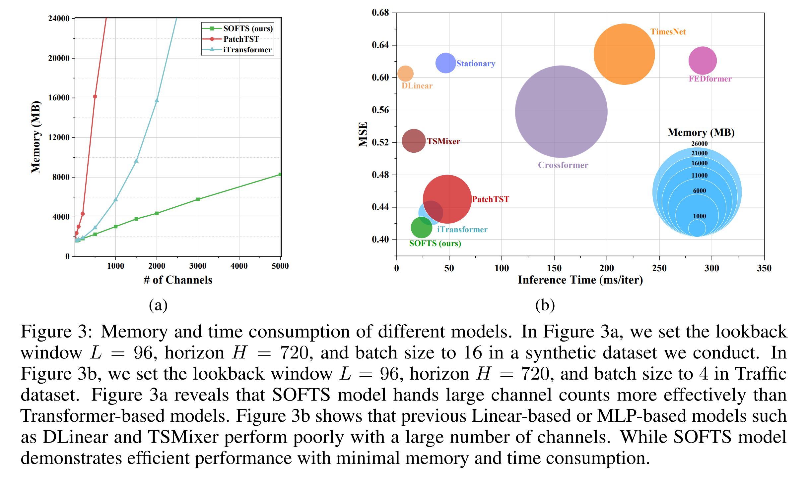

# (NeurIPS 2024) SOFTS: Efficient Multivariate Time Series Forecasting with Series-Core Fusion

The code repository for [SOFTS: Efficient Multivariate Time Series Forecasting with Series-Core Fusion](https://arxiv.org/pdf/2404.14197.pdf) in PyTorch. A scalable pure MLP model that achieves state-of-the-art performance on multivariate time series forecasting benchmarks. 

[[中文介绍]](https://mp.weixin.qq.com/s/KRolsx7OVYV-JS-MatpH1Q) [[Medium]](https://towardsdatascience.com/softs-the-latest-innovation-in-time-series-forecasting-dbc82553dd76)
[[TowardsAI]](https://towardsai.net/p/l/softs-efficient-multivariate-time-series-forecasting-with-series-core-fusion)

🚩 2024.9.26 Our paper has been accepted to NeurIPS 2024 as a poster presentation!

### Main Structure



#### Star Aggregate-Redistribute Module (STAR)


#### Performance Comparison



#### Efficiency Comparison



## Prerequisites

scikit-learn==1.2.2

numpy==1.22.4

pandas==1.2.4

torch==1.10.0+cu111

## Datasets

You can directly download the datasets used in the paper from [Google Drive](https://drive.google.com/drive/folders/1QPM7MMKlzVffdzbGGkzARDuIqiYRed_f?usp=drive_link) or [NJU Box](https://box.nju.edu.cn/d/abc2bbd7cff6461eb4da/). 

Once downloaded, place the datasets under folder `dataset/`, like `dataset/ETT-small`, `dataset/traffic`, etc.

## Run on your own dataset

### Choice 1: Use scripts to run
If you wish to utilize your own datasets, please follow these steps:

1. **Dataset Format**: Make sure your datasets follow the format of the provided datasets. Typically, the first column should contain dates, and the remaining columns should represent variables to predict. This consistency will help seamlessly integrate your datasets into the existing infrastructure.

2. **Dataset Class Creation**: Create a dataset class within `data_provider/data_loader.py`. Refer to the structure of the `Dataset_Custom` class for guidance. This class should handle the loading and preprocessing of your dataset.

3. **Update Data Dictionary**: Update the `data_dict` in `data_provider/data_factory.py` to include your dataset. 

4. **Usage in Scripts**: Utilize your dataset within the scripts by specifying the appropriate parameters. 
   - The `--data` parameter should match the dataset key within the `data_dict`.
   - The `--root_path` parameter should point to the folder containing your dataset.
   - The `--data_path` parameter should specify the file name of your dataset.

Refer to the examples in `scripts/long_term_forecast` for guidance on how to integrate your custom dataset into the existing scripts.

### Choice 2: Use the provided API
We have provided a custom exp class in `exp/exp_custom.py` and a guidance Jupyter notebook `run_on_your_own_dataset.ipynb` to help you run the model on your own dataset.

## Scripts

To reproduce the main results in Table 2, run the script files under folder `scripts/long_term_forecast`.

For example, to reproduce the results of SOFTS on ETTm1 dataset, run the following command:

```sh scripts/long_term_forecast/ETT_script/SOFTS_ETTm1.sh```

## Acknowledgement

We appreciate the following github repos a lot for their valuable code base or datasets:

https://github.com/zhouhaoyi/Informer2020

https://github.com/thuml/Autoformer

https://github.com/zhouhaoyi/ETDataset

https://github.com/laiguokun/multivariate-time-series-data

https://github.com/thuml/Time-Series-Library

https://github.com/thuml/iTransformer

## Reference

If you find our work useful in your research, please use the following citation:

```
@article{han2024softs,
  title={SOFTS: Efficient Multivariate Time Series Forecasting with Series-Core Fusion},
  author={Han, Lu and Chen, Xu-Yang and Ye, Han-Jia and Zhan, De-Chuan},
  journal={arXiv preprint arXiv:2404.14197},
  year={2024}
}
```
