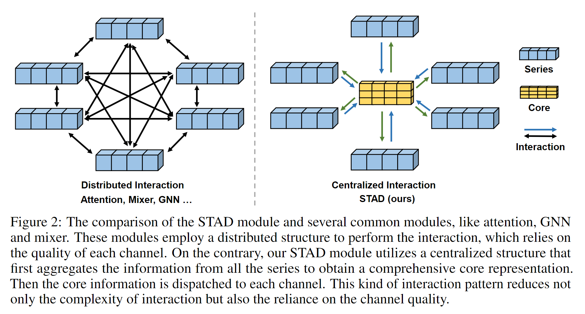

# SOFTS: Efficient Multivariate Time Series Forecasting with Series-Core Fusion

The code repository for [SOFTS: Efficient Multivariate Time Series Forecasting with Series-Core Fusion](https://arxiv.org/pdf/2404.14197.pdf) in PyTorch.

### Main Structure


#### Star Aggregate Dispatch Module (STAD)



#### Performance Comparison


#### Efficiency Comparison


## Prerequisites

scikit-learn==1.2.2

numpy==1.22.4

pandas==1.2.4

torch==1.10.0+cu111

## Datasets

We refer to [this repository](https://github.com/thuml/iTransformer) for downloading datasets.

## Scripts

To reproduce the main results in Table 2, run the script files under folder `scripts/long_term_forecast`.

For example, to reproduce the results of SOFTS on ETTm1 dataset, run the following command:

```sh scripts/long_term_forecast/ETT_script/SOFTS_ETTm1.sh```

## Acknowledgement

We appreciate the following github repos a lot for their valuable code base or datasets:

https://github.com/zhouhaoyi/Informer2020

https://github.com/thuml/Autoformer

https://github.com/zhouhaoyi/ETDataset

https://github.com/laiguokun/multivariate-time-series-data

https://github.com/thuml/Time-Series-Library

https://github.com/thuml/iTransformer
